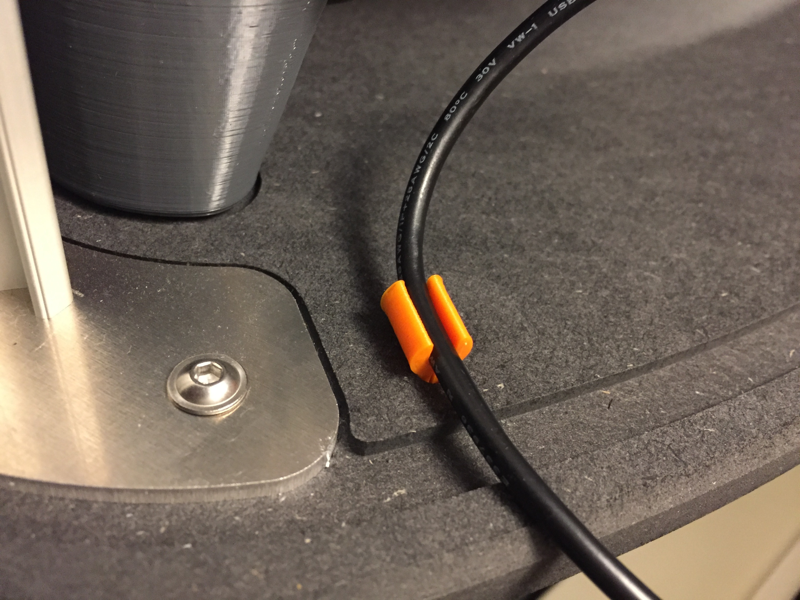

# Magis Protective Box

This repo contains things related to the [Dagoma Magis Protective Box](https://dagoma.fr/start/magis/caisson/start.html). 

## Clip

[Dagoma](https://dagoma.fr) has not released the STLs for the printed elements of the Magis Protective Box yet, so here is an STL (created with OpenSCAD) to print a clip that can fit in the holes at the back of the box.

